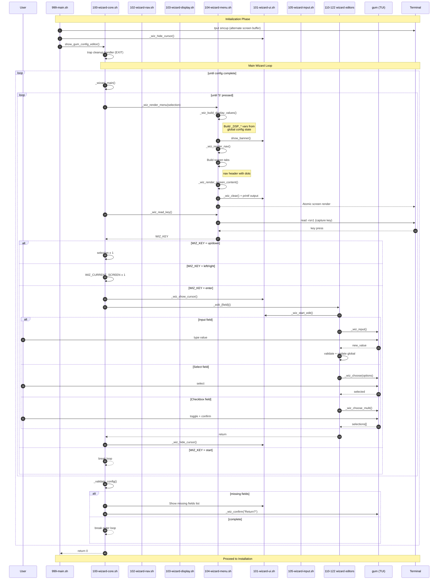
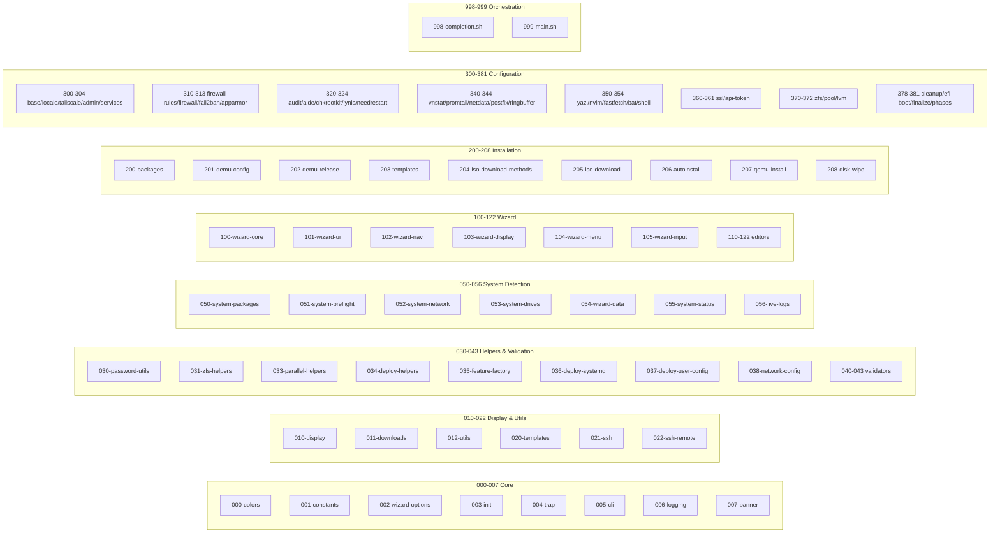

# Project Architecture

## Overview

This project is a bash automation framework that installs Proxmox VE on dedicated servers without console access. It runs a local QEMU VM with the Proxmox ISO, configures it via an interactive wizard, then deploys the configuration to the target system over SSH.

## High-Level Flow

```
┌─────────────────┐     ┌─────────────────┐     ┌─────────────────┐
│   Local Host    │     │    QEMU VM      │     │  Target Server  │
│                 │     │  (Proxmox ISO)  │     │   (Proxmox)     │
│  ┌───────────┐  │     │                 │     │                 │
│  │  Wizard   │──┼────►│  Installation   │────►│  Configuration  │
│  │   (TUI)   │  │ SSH │                 │     │                 │
│  └───────────┘  │     │                 │     │                 │
└─────────────────┘     └─────────────────┘     └─────────────────┘
```

**Execution Stages:**

1. **Initialization** (000-007) - Load colors, constants, parse CLI args, setup logging
2. **System Check** (050-056) - Verify requirements (root, RAM, disk, KVM), detect hardware
3. **Wizard** (100-105, 110-122) - Interactive configuration via TUI
4. **QEMU Setup** (200-208) - Download ISO, launch VM, wait for SSH
5. **Installation** (200-208) - Proxmox auto-install via templates
6. **Configuration** (300-381) - Deploy configs, install packages, harden
7. **Finalization** (378-381) - Cleanup, EFI boot, validate, shutdown VM

## Flow Diagram

```mermaid
flowchart TD
    subgraph INIT["🚀 Initialization (000-007)"]
        A[Start] --> B[Load core infrastructure<br/>000-colors, 001-constants,<br/>002-wizard-options, 003-init, 004-trap]
        B --> C[Parse CLI args<br/>005-cli.sh]
        C --> D[Setup logging & metrics<br/>006-logging.sh]
        D --> E[Show banner<br/>007-banner.sh]
    end

    subgraph SYSCHECK["🔍 System Check (050-056)"]
        E --> F{System<br/>requirements?<br/>051-preflight.sh}
        F -->|Fail| F1[Show errors]
        F1 --> F2[Exit 1]
        F -->|Pass| G[Detect interfaces<br/>052-system-network.sh<br/>Detect disks<br/>053-system-drives.sh]
    end

    subgraph WIZARD["🧙 Interactive Wizard (100-105, 110-122)"]
        G --> H[Enter alternate screen<br/>tput smcup]
        H --> I[Hide cursor]

        I --> J[Render menu<br/>104-wizard-menu.sh]

        J --> K{Read key<br/>102-wizard-nav.sh}
        
        K -->|↑↓| L[Change selection]
        L --> J
        
        K -->|←→| M[Switch screen<br/>Basic↔Proxmox↔Network↔Storage↔Services↔Access]
        M --> J
        
        K -->|Enter| N[Edit field]
        N --> O{Field type?}
        
        O -->|Input| P[_wiz_input<br/>gum input]
        O -->|Select| Q[_wiz_choose<br/>gum choose]
        O -->|Filter| R[_wiz_filter<br/>gum filter]
        O -->|Multi| S[_wiz_choose_multi<br/>gum choose --no-limit]
        
        P --> T{Valid?<br/>040-043 validators}
        Q --> U[Update global var]
        R --> U
        S --> U
        
        T -->|No| V[Show error]
        V --> N
        T -->|Yes| U
        U --> J
        
        K -->|Q/Esc| W{Confirm quit?}
        W -->|Yes| X[Exit 0]
        W -->|No| J
        
        K -->|S| Y{Config complete?}
        Y -->|No| Z[Show missing fields]
        Z --> J
        Y -->|Yes| AA[Exit wizard loop]
    end

    subgraph INSTALL["📦 Installation (200-208)"]
        AA --> AB[Download ISO<br/>205-iso-download.sh]
        AB --> AC[Launch QEMU VM<br/>201-qemu-config.sh]
        AC --> AD[Wait for SSH ready<br/>021-ssh.sh]
        AD --> AE[Deploy answer.toml<br/>206-autoinstall.sh]
        AE --> AF[Wait for Proxmox install]
    end

    subgraph CONFIG["⚙️ Configuration (300-381)"]
        AF --> AG[Enter live logs mode<br/>056-live-logs.sh]
        
        AG --> AH[Base config<br/>300-configure-base.sh]
        
        AH --> AI[run_parallel_group<br/>Security features]
        
        AJ --> AK[run_parallel_group<br/>Monitoring]
        AK --> AL[340-343: vnstat/promtail/netdata/postfix]
        
        AL --> AM[run_parallel_group<br/>Tools]
        AM --> AN[350-351: Yazi/Nvim]
        
        AN --> AO[Tailscale config<br/>301-configure-tailscale.sh]
        AO --> AP[Admin user<br/>302-configure-admin.sh]
        AP --> AQ[Firewall<br/>310-configure-firewall.sh]
        AQ --> AR[SSL certs<br/>360-configure-ssl.sh]
        AI --> AJ[310-313: Firewall rules/Firewall/Fail2ban/AppArmor<br/>320-324: Auditd/AIDE/chkrootkit/Lynis/needrestart]
        AR --> AS{USE_EXISTING_POOL?}
        AS -->|Yes| AT1[Import pool<br/>zpool import -f]
        AS -->|No| AT2[Create pool<br/>zpool create]
        AT1 --> AU[Configure storage]
        AT2 --> AU
    end

    subgraph FINALIZE["✅ Finalization (378-381)"]
        AU --> AV[Run validation script<br/>380-configure-finalize.sh]
        AV --> AW{All checks pass?}
        AW -->|No| AX[Show failures]
        AW -->|Yes| AY[Configure EFI fallback<br/>379-configure-efi-boot.sh]
        AY --> AY2[Cleanup logs & ZFS sync<br/>378-configure-cleanup.sh]
        AY2 --> AZ[Shutdown VM]
        AZ --> BA[End]
    end

    style INIT fill:#1a1a2e,stroke:#16213e
    style SYSCHECK fill:#1a1a2e,stroke:#16213e
    style WIZARD fill:#0f3460,stroke:#16213e
    style INSTALL fill:#533483,stroke:#16213e
    style CONFIG fill:#e94560,stroke:#16213e
    style FINALIZE fill:#1a1a2e,stroke:#16213e
```



## Wizard Sequence Diagram



## Script Numbering Overview



## Component Architecture

```
scripts/
├── 000-007: Core Infrastructure
│   ├── 000-colors.sh    # Terminal colors (CLR_*, HEX_*), version
│   ├── 001-constants.sh # DNS servers, timeouts, ports, resource limits
│   ├── 002-wizard-options.sh # WIZ_* menu option lists
│   ├── 003-init.sh      # Globals, runtime variables
│   ├── 004-trap.sh      # Cleanup trap, temp file registry
│   ├── 005-cli.sh       # CLI argument parsing
│   ├── 006-logging.sh   # Log functions, metrics
│   └── 007-banner.sh    # ASCII art banner
│
├── 010-012: Display & Utilities
│   ├── 010-display.sh   # print_* functions, progress indicator
│   ├── 011-downloads.sh # File download with retry
│   └── 012-utils.sh     # Secure file deletion
│
├── 020-022: Templates & SSH
│   ├── 020-templates.sh    # Template substitution
│   ├── 021-ssh.sh       # SSH session management
│   └── 022-ssh-remote.sh# remote_* execution functions
│
├── 030-038: Helpers
│   ├── 030-password-utils.sh     # Password generation
│   ├── 031-zfs-helpers.sh        # ZFS RAID mapping
│   ├── 033-parallel-helpers.sh   # Parallel execution
│   ├── 034-deploy-helpers.sh     # deploy_template, parallel copies, timer deployment
│   ├── 035-feature-factory.sh    # Feature wrapper factories
│   ├── 036-deploy-systemd.sh     # Systemd timer/service deployment
│   ├── 037-deploy-user-config.sh # User config deployment
│   └── 038-network-config.sh     # Network interface generators
│
├── 040-043: Validation Layer
│   ├── 040-validation-basic.sh   # Hostname, user, email, password
│   ├── 041-validation-network.sh # Subnet, IPv6
│   ├── 042-validation-dns.sh     # DNS resolution
│   └── 043-validation-security.sh# SSH key, Tailscale, disk space
│
├── 050-056: System Detection Layer
│   ├── 050-system-packages.sh    # Required package installation
│   ├── 051-system-preflight.sh   # Requirements validation (root, RAM, etc.)
│   ├── 052-system-network.sh     # Interface, IP detection
│   ├── 053-system-drives.sh      # Drive detection, role assignment
│   ├── 054-system-wizard-data.sh # Timezones, countries loading
│   ├── 055-system-status.sh      # Status display
│   └── 056-live-logs.sh          # Live log display
│
├── 100-122: Wizard Layer
│   ├── 100-wizard-core.sh    # Main wizard loop
│   ├── 101-wizard-ui.sh      # UI rendering, gum wrappers
│   ├── 102-wizard-nav.sh     # Navigation header rendering, key reading
│   ├── 103-wizard-display.sh # Display value formatters
│   ├── 104-wizard-menu.sh    # Menu rendering
│   ├── 105-wizard-input.sh   # Input helpers, validation, editor helpers
│   ├── 110-wizard-basic-locale.sh # Country to locale mapping
│   ├── 111-wizard-basic.sh   # Hostname, email, password, timezone
│   ├── 112-wizard-proxmox.sh # ISO version, repo type
│   ├── 113-wizard-network-bridge.sh # Interface, bridge mode, MTU
│   ├── 114-wizard-network-ipv6.sh   # IPv6, firewall mode
│   ├── 115-wizard-storage.sh # Boot disk, pool mode, ZFS mode
│   ├── 116-wizard-ssl.sh     # SSL certificate type
│   ├── 117-wizard-tailscale.sh # Tailscale VPN
│   ├── 118-wizard-access.sh  # Admin user, API token
│   ├── 119-wizard-ssh.sh     # SSH key editor
│   ├── 120-wizard-disks.sh   # Disk detection
│   ├── 121-wizard-features.sh# Optional features selection
│   └── 122-wizard-postfix.sh # Postfix mail relay
│
├── 200-208: Installation Layer
│   ├── 200-packages.sh    # Repo setup, package installation
│   ├── 201-qemu-config.sh # QEMU configuration
│   ├── 202-qemu-release.sh# Drive release functions
│   ├── 203-templates.sh   # Template deployment
│   ├── 204-iso-download-methods.sh # Download methods (aria2c, curl, wget)
│   ├── 205-iso-download.sh# ISO version detection, download
│   ├── 206-autoinstall.sh # Proxmox auto-install answer file
│   ├── 207-qemu-install.sh# QEMU installation launcher
│   └── 208-disk-wipe.sh   # Disk wipe before install
│
├── 300-381: Configuration Layer
│   ├── 300-configure-base.sh      # Base system config
│   ├── 301-configure-locale.sh    # Locale files
│   ├── 302-configure-tailscale.sh # VPN setup
│   ├── 303-configure-admin.sh     # Admin user creation
│   ├── 304-configure-services.sh  # System services
│   ├── 310-configure-firewall-rules.sh # nftables rule generators
│   ├── 311-configure-firewall.sh  # nftables main config
│   ├── 312-configure-fail2ban.sh  # Intrusion prevention
│   ├── 313-configure-apparmor.sh  # MAC enforcement
│   ├── 320-configure-auditd.sh    # Kernel audit
│   ├── 321-configure-aide.sh      # File integrity
│   ├── 322-configure-chkrootkit.sh# Rootkit scanner
│   ├── 323-configure-lynis.sh     # Security audit
│   ├── 324-configure-needrestart.sh # Service restart checker
│   ├── 340-configure-vnstat.sh    # Bandwidth monitoring
│   ├── 341-configure-promtail.sh  # Log collector
│   ├── 342-configure-netdata.sh   # Real-time monitoring
│   ├── 343-configure-postfix.sh   # Mail relay
│   ├── 344-configure-ringbuffer.sh# Network tuning
│   ├── 350-configure-yazi.sh      # File manager
│   ├── 351-configure-nvim.sh      # Editor
│   ├── 352-configure-fastfetch.sh # Shell system info
│   ├── 353-configure-bat.sh       # Syntax highlighting
│   ├── 354-configure-shell.sh     # ZSH/Oh-My-Zsh configuration
│   ├── 360-configure-ssl.sh       # Certificates
│   ├── 361-configure-api-token.sh # Proxmox API
│   ├── 370-configure-zfs.sh       # ZFS ARC tuning
│   ├── 371-configure-zfs-pool.sh  # Pool creation or import
│   ├── 372-configure-lvm.sh       # LVM storage configuration
│   ├── 378-configure-cleanup.sh   # Log cleanup, ZFS sync
│   ├── 379-configure-efi-boot.sh  # EFI fallback bootloader
│   ├── 380-configure-finalize.sh  # SSH, validation, finalization
│   └── 381-configure-phases.sh    # Configuration phases
│
└── 998-999: Orchestration
    ├── 998-completion.sh  # Completion screen
    └── 999-main.sh  # Main entry point
```

## Data Flow

### Configuration State

All configuration stored in global variables (defined in `003-init.sh`, constants in `001-constants.sh`):

```
User Input (Wizard) → Global Variables → Template Substitution → Remote Files
```

**Key variable categories:**

- `PVE_*` - Proxmox settings (hostname, repo, ISO)
- `MAIN_IPV4/6*` - Network configuration
- `ZFS_*` - Storage settings (RAID mode, ARC)
- `BOOT_DISK` - Separate boot disk path
- `USE_EXISTING_POOL` - Import existing pool instead of creating
- `EXISTING_POOL_NAME` - Pool name to import
- `INSTALL_*` - Feature flags (yes/no)
- `ADMIN_*` - User credentials

### Template Pipeline

```
templates/*.tmpl → apply_template_vars() → /tmp/staged → remote_copy() → /target/path
```

Template variables use `{{VARIABLE}}` syntax. Special characters auto-escaped.

### SSH Communication

```
┌─────────────┐    sshpass + SSH    ┌─────────────┐
│ Local Host  │◄──────────────────►│   QEMU VM   │
│             │    Port 5555        │  (Proxmox)  │
└─────────────┘                     └─────────────┘

Session Management:
- _ssh_session_init()    → Create passfile once
- remote_exec()          → Low-level command
- remote_run()           → High-level with progress
- remote_copy()          → File transfer
- _ssh_session_cleanup() → Secure passfile deletion
```

### Parallel Execution

```
run_parallel_group "label" "done_msg" func1 func2 func3
         │
         ├── func1 ──► $result_dir/success_0 or fail_0
         ├── func2 ──► $result_dir/success_1 or fail_1
         └── func3 ──► $result_dir/success_2 or fail_2
                              │
                    ◄─────────┘
              Collect results, show single progress
```

## Wizard Architecture

### Screen Navigation

```
┌─────────────────────────────────────────────────────────────┐
│  ○ Basic   ○ Proxmox   ● Network   ○ Storage   ○ Services  │
│  ━━━━━━━━━━━━━━━━━━━━━━━◉━━━━━━━━━━━─────────────────────── │
└─────────────────────────────────────────────────────────────┘

Navigation:
- ←/→  Switch screens
- ↑/↓  Move within screen
- Enter  Edit field
- S  Start installation
- Q  Quit
```

### Component Breakdown

The wizard is split into modular components:

- **100-wizard-core.sh** - Main loop, event handling
- **101-wizard-ui.sh** - Gum wrappers, field formatting, validation error display
- **102-wizard-nav.sh** - Navigation header rendering, key reading
- **103-wizard-display.sh** - Display value formatters
- **104-wizard-menu.sh** - Menu rendering
- **105-wizard-input.sh** - Input helpers, validation, editor helpers (password, checkbox, toggle)

### Field Mapping

```bash
WIZ_SCREENS=("Basic" "Proxmox" "Network" "Storage" "Services" "Access")

# Each screen populates _WIZ_FIELD_MAP:
_WIZ_FIELD_MAP[0]="hostname"
_WIZ_FIELD_MAP[1]="domain"
# ...

# Selection triggers editor:
field="${_WIZ_FIELD_MAP[$selection]}"
"_edit_${field}"  # Calls _edit_hostname, _edit_domain, etc.
```

## Installation Flow

### ISO Download (203-iso-download.sh)

```
1. Fetch available versions from Proxmox downloads (v9+ only, last 5)
2. Parse version list (PVE_AVAILABLE_VERSIONS array)
3. Select version via wizard or CLI
4. Download ISO with retry logic
5. Verify checksum
```

### Auto-Install (204-autoinstall.sh)

```
1. Generate answer file from wizard config
2. Deploy to ISO via QEMU
3. Wait for installation completion
4. Reboot into installed system
```

## Feature Configuration Pattern

Each optional feature follows consistent pattern:

```bash
# 1. Feature flag (set in wizard)
INSTALL_FEATURE="yes"

# 2. Parallel wrapper (checks flag)
_parallel_config_feature() {
  [[ $INSTALL_FEATURE != "yes" ]] && return 0
  _config_feature
}

# 3. Config function (does actual work)
_config_feature() {
  deploy_template "feature.conf.tmpl" "/etc/feature/config"
  deploy_systemd_timer "feature"
  remote_run "Enable feature" 'systemctl enable --now feature'
}

# 4. Templates
templates/feature.conf.tmpl
templates/feature.service.tmpl
templates/feature.timer.tmpl
```

## Error Handling Strategy

No `set -e` - all error handling explicit:

```bash
# Pattern 1: Fail fast
command || { log "ERROR: Failed"; return 1; }

# Pattern 2: Warn and continue
command || log "WARNING: Non-critical failure"

# Pattern 3: Cleanup on exit
trap '_cleanup_handler' EXIT

_cleanup_handler() {
  [[ $BASHPID != "$$" ]] && return  # Only main shell
  secure_delete_file "$passfile"
  [[ $QEMU_PID ]] && kill "$QEMU_PID" 2>/dev/null
}
```

## Testing Strategy

```bash
# Run in Docker (not macOS - bash 3.2 incompatible)
docker run --rm -v "$(pwd):/app" -w /app ubuntu:22.04 bash -c '
  apt-get update -qq && apt-get install -y -qq curl git >/dev/null 2>&1
  curl -fsSL https://git.io/shellspec | sh -s -- --yes >/dev/null 2>&1
  ~/.local/lib/shellspec/shellspec --format documentation
'
```

**Test organization:**

```
spec/
├── unit/
│   ├── 002_logging_spec.sh
│   ├── 010_display_spec.sh
│   ├── 040_validation_spec.sh
│   └── ...
└── support/
    └── mocks, fixtures
```

## Security Considerations

- **Passfile management**: Created once, reused, securely deleted on exit
- **Password generation**: `/dev/urandom` with alphanumeric + special chars
- **Template escaping**: Special chars auto-escaped before substitution
- **Input validation**: All user inputs validated before use
- **Credential display**: Only shown on completion screen, not logged
- **Cleanup trap**: Ensures sensitive files deleted on any exit

## File Number Ranges

| Range     | Purpose                                      |
|-----------|----------------------------------------------|
| 000-007   | Core init (colors, constants, wizard opts, init, trap, cli, logging, banner) |
| 010-012   | Display & utilities                          |
| 020-022   | Templates & SSH                              |
| 030-038   | Helpers (password, zfs, parallel, deploy, feature-factory, systemd, user-config, network) |
| 040-043   | Validation (basic, network, dns, security)   |
| 050-056   | System detection (packages, preflight, network, drives, wizard-data, status, live-logs) |
| 100-105   | Wizard core (main loop, UI, nav, display, menu, input) |
| 110-122   | Wizard editors (screens, postfix)            |
| 200-208   | Installation (packages, QEMU, templates, ISO, autoinstall, disk wipe) |
| 300-304   | Base configuration (base, locale, tailscale, admin, services) |
| 310-313   | Security - Firewall & access control         |
| 320-324   | Security - Auditing & integrity              |
| 340-344   | Monitoring & Mail (vnstat, promtail, netdata, postfix, ringbuffer) |
| 350-354   | Tools (yazi, nvim, fastfetch, bat, shell)    |
| 360-361   | SSL & API                                    |
| 370-372   | Storage (ZFS, LVM)                           |
| 378-381   | Finalization (cleanup, EFI, finalize, phases) |
| 998-999   | Completion screen, main orchestrator         |

